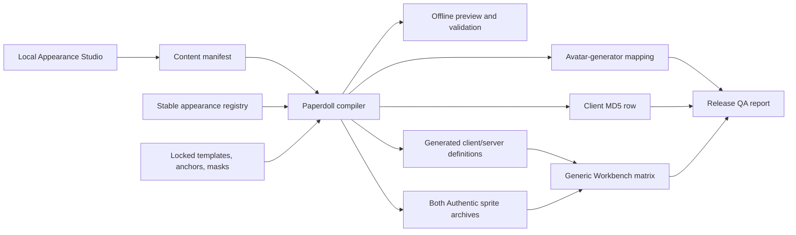

# Voidscape Appearance Studio / Paperdoll Compiler

Status: **Paperdoll V2 R9 PC evaluation checkpoint complete; approved only for staff on disposable local QA data**

Date: 2026-07-11

Scope: approved architecture, implemented evaluation path, and remaining
adoption gates. Production-default, Android, TeaVM, and avatar activation remain
unapproved.

## Superseding decision: true 2× Paperdoll V2

The earlier compiler-to-legacy recommendation below remains useful for classic,
retro, and avatar-compatible exports, but it is no longer the selected visual
destination. After direct panel review showed that a 16×18 legacy head cannot
carry the desired hair geometry, Voidscape selected a true 2× paperdoll as the
primary custom-client path. The live renderer is still not rewritten first:
the canonical authoring format, deterministic compiler, strict pack, editor,
and isolated renderer oracle come first. A separate 1× compiler remains the
compatibility output; R9 now emits its build-only overlays, while production
installation and avatar parity remain gated.

The locked V2 contract is:

- 128×204 walking canvases and 168×204 combat canvases;
- 176×224 isolated proof panels with the player drawn at `(24,4)` and true 2×
  size;
- separate ARGB semantic channels for skin, hair, facial hair, clothing,
  equipment, secondary colour, and fixed pixels;
- six stored masters (`north`, `north-west`, `west`, `south-west`, `south`,
  `combat-west`), deterministic three-phase propagation, and runtime mirrors;
- explicit crown-relative face/scalp/ear/neck/nape anchors and digest-bound
  masks;
- a deterministic `Paperdoll_V2.orsc` ZIP containing raw Java `Sprite` records
  plus a closed `registry.properties` contract;
- whole-player fallback if a runtime pack, channel, or frame is missing;
  never substitute frame zero for another phase;
- render density independent of the existing `GAME_LOOK_HD` post-process.

For a future full scene, the selected PC proof viewport is 1024×680: a
1024×668 game area plus the existing 12-pixel footer. Projection shift 10 keeps
the same world field of view as the classic 512×334 area at shift 9. Android
and TeaVM are deliberately later performance slices because true 2× has four
times the scene pixel cost.

No new opcode, packet field, save column, or server appearance model is needed
for the planned first runtime path. Existing `hairStyle` can select a hairstyle;
existing head/Look identity can select baked facial combinations. A third
independent beard byte is deferred until actual content pressure justifies a
versioned protocol decision.

### 2026-07-11 PC evaluation checkpoint

The approved architecture has now reached a guarded PC runtime evaluation, not
a production release. The canonical R9 catalog contains male and female base
profiles plus six stable hairstyle selectors: `rare_spikes`, `faded_buzzcut`,
`mohawk`, `textured_crop`, `slick_back_undercut`, and `high_topknot`. Selector
`0` remains Classic. The catalog is still explicitly `shipping:false` and
`defaultEnabled:false`.

Two clean builds produced byte-identical outputs. The catalog SHA-256 is
`b9080221cfd5843b25e84faa814ce3860cc599d550fccd796b2ed00be71050b9`;
the 720-entry, 18-asset, 16-stack pack SHA-256 is
`46f3fe89c01f55563b5692711ee054082ebd610d123cba506bae64cb334adbb7`.
The selector properties, legacy compatibility properties, and compatibility
manifest digests are respectively
`53ae87582971f73b90a30754fcc7a0c11cd0e2dac2f0daebfbc8c45e508ed804`,
`302e561a5a3d999726b80fc88f7fc2976241cf4d55a06132494367b4b216fbc5`,
and `2e2efc7378bd2467a33aff6f4a66e6feaa89355975a3bf776bf03ef510636250`.

The selector runtime replaces the complete base player only after an atomic
preflight. Any missing/rejected pack or selector, unknown style, incompatible
head/body/legs identity, invalid frame/geometry, or nonzero hat selects the
untouched whole-player legacy renderer before a V2 pixel is drawn. Forced,
missing-pack, and rejected-pack matrices also proved a digest-bound 1x
hairstyle compatibility overlay. Hats suppress that overlay as well, preserving
the complete legacy hat composition. No partial V2 player and no frame-zero
substitution are allowed.

The server/designer path is separately fail-closed. It requires an exact
six-style config maximum plus a JVM gate, a disposable SQLite `*_qa` database,
no production command lockdown, `avatar_generator:false`, creation mode `0`, a
loopback Workbench client, and a server-developer account. First-login character
creation never exposes the V2 Style control. Plate/head-slot gear that replaces
the required base identity blocks the appearance session; compatible
weapon/shield and overlay equipment remains on the legacy layer path around the
V2 base.

The checkpoint recommendation is **GO only for bounded staff PC evaluation on
disposable QA data**. It is **NO-GO for production-default activation, Android,
TeaVM, and avatars**. Android/web builds deliberately do not initialize the V2
runtime, although the Android debug and TeaVM compile/package gates pass. They
still lack runtime visual/performance evidence. The server evaluation gate
deliberately disables the live avatar generator. See
`docs/reports/paperdoll-v2-evaluation-2026-07-11.md` for exact evidence,
fallback matrices, blockers, and rollback.

The implemented V2 contracts live at these repository surfaces:

- `content/appearance/templates/rsc-player-2x-v1/` — locked canvases, anchors,
  derived masks, base references, and template digests;
- `content/appearance/v2/catalog.yaml` and
  `content/appearance/v2/hairstyles/*/` — stable selectors, base-profile
  eligibility, six masters per style, and art provenance/digests;
- `tools/appearance-studio/appearance_studio/v2_*.py`,
  `tools/appearance-studio/web/v2.*`, and `scripts/appearance-v2.sh` — editor,
  compiler, strict pack/compatibility export, validation, and oracle comparison;
- `Client_Base/src/orsc/appearance/v2/` and the narrow V2 calls in
  `Client_Base/src/orsc/mudclient.java` — strict pack/selector/compatibility
  readers, palette/base contracts, atomic preflight, whole-player renderer, and
  designer preview;
- `PC_Client/src/orsc/WorkbenchServer.java` and
  `scripts/run-workbench-client.sh` — loopback launch gates, diagnostics,
  selector/live-scene/benchmark/runtime-matrix evidence;
- `server/src/com/openrsc/server/appearance/PaperdollV2EvaluationPolicy.java`,
  `server/src/com/openrsc/server/ServerConfiguration.java`,
  `server/src/com/openrsc/server/model/PlayerAppearance.java`,
  `server/src/com/openrsc/server/service/PlayerService.java`, and
  `server/src/com/openrsc/server/net/rsc/handlers/PlayerAppearanceUpdater.java`
  — disposable-QA startup policy, validation, existing-field persistence, and
  hydration.

The existing appearance packet opcode and database `hairstyle` field are reused.
There is no new opcode, packet width, save column, Authentic archive entry, MD5
row, or production maximum in this checkpoint.

### Alternatives after the visual pivot

| Approach | Result | Decision |
|---|---|---|
| Compiler to legacy paperdoll | Safest compatibility path, but physical head detail remains 1× | Keep as retro/avatar/classic output, not the main visual target |
| Runtime layered 2× renderer | Preserves semantic layers and materially improves silhouettes/detail | **Selected, after compiler/oracle gates** |
| Offline 3D-to-sprite | Useful for concepts or master material, but still needs 2D cleanup and deterministic compilation | Optional importer only |

### Original approved implementation slices

1. **Non-shipping 2× proof:** locked template, compiler/pack, browser editor,
   isolated Java Workbench oracle, individual 30-state panels, tint/alpha/mask
   validation, and a nearest-2× legacy control. The user narrowed the visual
   fixture to a faithful untouched bald head plus one rare Coal high-spike
   hairstyle; rejected mustache and police-cap proof pixels are not included.
2. **Dev-only PC scene proof:** 1024×680 / projection-shift-10 native scene,
   depth ordering, unchanged field of view, and measured performance.
3. **Full base bodies and opt-in activation:** male/female body and legs,
   cache/version/fallback/avatar policy, with no packet or schema change.
4. **Common equipment:** hats and worn equipment plus explicit hair-occlusion
   policies.
5. **Android/TeaVM:** render-density controls, pre-presentation parity, memory,
   and performance gates.

Each slice originally stopped for explicit approval. The R9 checkpoint above
supersedes the old progress markers while preserving this list as design
history. Equipment, Android/TeaVM, avatar parity, and production activation
remain separate future gates.

### Historical Slice 1 implementation boundary and evidence

Slice 1 adds only the `rsc-player-2x-v1` template, tmp-only authoring/compiler
tools, a deterministic proof-art source, new isolated V2 Java classes, and a
Workbench-only route. It does **not** change production selectors, client caps,
normal scene rendering, cache archives, MD5 data, server behaviour, packets,
persistence, or the existing `style_01` assets.

The original hair-only proof contains five assets (`legacy_head`, `legacy_body`,
`legacy_legs`, `native_head`, `hair_rare_spikes`), two stacks (`control` and
`rare_hair`), and 216 registry-declared sprite records. Every hair master is one
4-connected scalp-attached component. Legacy `R=255,G=B` skin-mask inputs are
normalized to the neutral `0x76/0xB0/0xFF` semantic ramp before tinting, so a
V2 head and live legacy body use the same visible skin tone instead of producing
a salmon face/pale-arm seam. Native tint channels reject non-grayscale pixels.
That proof pack SHA-256 was
`6d73ec03eaa26dbe45e545a974a3aaa8588b0ff0714c136cfe86459cc56db7e7`.
The isolated Java run produced 60 captures; the Python/Java comparison reports
zero mismatched frames and zero mismatched pixels for the complete pack-only
control and V2-only slot-0 hair/head raster. Full `rare_hair` panels separately
exercise live legacy body, legs, sword, and shield ordering for human review.

The R9 catalog and runtime checkpoint supersede this original single-style
proof. The remainder of this document records the earlier legacy-first
architecture and its completed compatibility foundations. Where it calls
Paperdoll V2 a deferred option, the superseding decision and checkpoint above
take precedence.

## Decision

Build a canonical 2D appearance authoring system and compiler that emits the existing RuneScape Classic paperdoll format. Keep the live 12-slot renderer, current appearance packet shape, and `.orsc` sprite encoding. Add only a narrow compatibility bridge so compiler-managed appearance IDs and sprite bases are explicit registry values instead of consequences of `AnimationDef` source order.

Treat a runtime Paperdoll V2 as a later, optional consumer of the same canonical manifests and transparent layers. Treat offline 3D rendering as an optional concept/master-layer importer, not the source of truth and not a prerequisite.

Phase 1 targets Voidscape's active `custom_sprites: false` / `Authentic_Sprites.orsc` profile. `custom_sprites: true` worlds must fail validation as unsupported unless a separate profile mapping is deliberately added; the compiler must never silently reuse authentic-profile numbers there.

The Cowboy hat is the byte-preserving adoption and end-to-end QA fixture. A future mullet + mustache Look is the schema/compositor test case. Neither asset's art is regenerated in the approved discovery phase or the proposed foundation slices.

## Feature frame

One versioned manifest should be sufficient to author, preview, validate, reserve, compile, and publish a hat, hairstyle, facial-hair layer, clothing/equipment layer, or bundled Look to all of the legacy outputs that Voidscape actually consumes.

Success means:

- canonical appearance identity does not depend on Java list position;
- canonical sprite placement does not depend on hand-copied sidecars;
- rigid head/face attachments can start from a small set of master directions;
- generated frames, masks, sidecars, definitions, archives, hashes, avatar mappings, and QA matrices are deterministic;
- a dry run shows every proposed byte/source change before applying it;
- an apply can be reversed by a hash-guarded undo manifest;
- the real client rasterizer verifies every walking direction/pose and both combat orientations;
- generated image material cannot bypass canonical geometry, palette, overlap, and frame-consistency validation.

Non-goals for Phase 1:

- replacing the live renderer;
- adding paperdoll slots or changing the 12-slot layer meanings;
- independently persisting hair, beard, or mustache runtime fields;
- making the active authentic-archive profile automatically compatible with OpenPK/Cabbage custom-sprite layouts;
- generating or revising Cowboy or mullet/mustache production art;
- building a 3D character rig.

## Discovery summary

### Client identity and rendering

`EntityHandler` stores `AnimationDef`s in a source-ordered list, and player layer values are currently one-based list positions: the client receives shorts into `ORSCharacter.layerAnimation[]`, then `drawPlayerCompositeLayers(...)` subtracts one before calling `EntityHandler.getAnimationDef(...)` (`Client_Base/src/com/openrsc/client/entityhandling/EntityHandler.java:18`, `:101-109`; `Client_Base/src/orsc/PacketHandler.java:2963-2969`; `Client_Base/src/orsc/mudclient.java:17533-17540`). `loadEntitiesAuthentic()` separately assigns each first unique animation name a 27-slot sprite base, deduplicates repeated names, and jumps from `1998` to `3300` (`mudclient.java:34189-34214`). Consequently, one source edit can change both the wire-facing appearance identity and the archive base.

The draw model itself is suitable to keep. It has twelve fixed slots and an eight-direction layer-order table (`mudclient.java:480-484`). Frames `0..14` are five authored directions times three walking poses; SE/E/NE mirror SW/W/NW. Frames `15..17` are the optional combat set (`hasA`). Frames `18..26` are the optional independently authored mirrored side (`hasF`), despite the field's stale “special fighting” comment (`mudclient.java:17544-17581`, `:17668-17699`). Every unique name reserves a full 27-slot stride even when only 15 or 18 entries are loaded.

### Geometry and palette

Each authentic sprite is a numeric ZIP entry containing a 25-byte big-endian header followed by int32 pixels (`Client_Base/src/com/openrsc/client/model/Sprite.java:48-75`, `:158-177`). `requiresShift`, `xShift`, `yShift`, `something1`, and `something2` place the cropped sprite on its logical canvas; mirroring changes the effective X shift (`Client_Base/src/orsc/graphics/two/GraphicsController.java:3231-3260`). These values are runtime geometry, not optional documentation.

Palette behavior is exact, not approximate. Grayscale pixels use the primary mask; `R=255 && G=B` pixels use the skin mask; a configured blue mask recognizes `R=G && B!=G`; zero is transparent (`GraphicsController.java:1293-1324`). `charColour` values `1`, `2`, and `3` select player hair, top, and bottom colors (`mudclient.java:17590-17602`). Even `charColour=0` does not make arbitrary grayscale safe: it becomes a white primary mask. Fixed-color art therefore also needs forbidden-mask-pattern validation.

### Server, creation, and compatibility

The server stores base appearance fields in `PlayerAppearance` and merges equipment into the same twelve worn slots. Current valid heads are hard-coded as `{1, 4, 6, 7, 8}` (`server/src/com/openrsc/server/model/PlayerAppearance.java:34-35`, `:152-154`, `:181-209`). Player appearance updates retain the existing layer-count plus appearance-ID payload, with custom clients receiving short IDs; no new opcode is needed for another legacy-compatible appearance.

Character creation/change is a tighter contract. It sends zero-based head/body
selections as one byte. Discovery found that the server promoted both signed
`byte` values directly with `+ 1`, which made a managed head near appearance
`247` wrap negative. The implemented bridge now decodes only the selectable
head byte unsigned before adding one; body decoding remains `bodyType + 1`
because current body IDs do not need the upper half. This preserves the packet
shape and supports selectable head appearance IDs `1..256`; exhausting that
range still requires a future versioned packet decision.

Retro/authentic clients have additional byte and conversion limits. Unknown modern appearances currently convert to `NOTHING` (`server/src/com/openrsc/server/util/rsc/AppearanceRetroConverter.java:156-158`). Each manifest must declare a retro fallback or explicitly declare the appearance custom-client-only.

### Archives and allocation hazards

Voidscape's active path reads `Client_Base/Cache/video/Authentic_Sprites.orsc`; the avatar generator reads `server/conf/server/data/Authentic_Sprites.orsc`. Managed worn entries must match byte-for-byte across those two archives, but the archives as wholes are already intentionally different. `Client_Base/Cache/MD5.SUM` hashes the client copy.

The source-derived “next base” is diagnostic only. At discovery time Cowboy is appearance `245`, runtime list index `244`, base `1890`, frames `1890..1907`; Void Wyrm follows as appearance `246`, base `1917`. Counting unique names suggests `1944`, `1971`, then the `1998 -> 3300` jump. This is not a safe allocation algorithm: entries already exist at the apparent next bases, and the post-jump space overlaps other global sprite consumers, including relocated media around `3318..3326`. New managed blocks need a separately audited namespace and explicit registry reservations.

### Existing tools

The hairstyle tool already proves locked bald bases, transparent hair layers, RSC mask normalization, a browser canvas editor, approximate player-scale preview, and dry-run packing (`tools/hairstyle-art/hairstyle_tool.py`). Its limitations are equally clear: it hard-codes five heads, edits all 18 cells independently, has no named anchors or mirror/propagation model, handles only hair, directly overwrites working PNGs, and its preview is an approximation rather than the real rasterizer.

`tools/voidscim-art` already provides correct authentic sprite encode/decode, sidecar preservation, hard-mask packing, Cowboy-specific master-cell propagation, and wearable layout validation. Its wearable commit path is incomplete: it mutates only the client archive, client `AnimationDef`, and server item JSON; it does not update the server archive, MD5, constants, avatar mapping, or offer the promised wielded restore command (`tools/voidscim-art/voidscim/pack_wielded_cmd.py:358-443`).

The checked-in Cowboy art validates across all 18 frames, both archives contain byte-identical entries `1890..1907`, and the current Cowboy/packer/validator suites pass. However, `AvatarGenerator` has a separately duplicated animation list with no `cowboyhat`, so the server-side archive copy alone does not make Cowboy avatars correct (`server/src/com/openrsc/server/avatargenerator/AvatarGenerator.java:28-46`, `:685-714`, `:778-799`).

### Workbench QA

The sanctioned Workbench can reload authentic entity sprites and capture exact client frames (`PC_Client/src/orsc/WorkbenchServer.java:75-104`, `:130-149`, `:375-385`). Its Cowboy scenario is hard-coded to appearance `245`, hat slot `5`, five stored directions, and Combat A. It proves offsets `0..17`, but it does not independently render the three mirrored directions, Combat B, arbitrary slots, or multi-layer Looks (`WorkbenchServer.java:51-61`, `:1134-1302`).

## Architecture-shaping unknowns

| Question | Resolution |
|---|---|
| Can the live draw algorithm remain? | **[answered by discovery]** Yes. The current 12-slot composition, mirroring, masks, and sidecars are the compatibility target. |
| Can IDs continue to be inferred from `AnimationDef` order? | **[answered by discovery]** No. List position and unique-name order are two independent unstable identities. |
| Is the apparent next archive base safe? | **[answered by discovery]** No. Archive presence and shared sprite-memory namespaces must be audited; a 27-stride count is not ownership evidence. |
| Does packing the server archive complete avatar support? | **[answered by discovery]** No. `AvatarGenerator` also needs an ID-to-definition/base mapping. |
| Are Looks new runtime layers in Phase 1? | **[resolved design choice]** No. A Look is a canonical authoring bundle compiled to existing legacy fields/blocks. Mullet + mustache becomes one baked head block while its source layers remain separate. |
| Does Phase 1 support `custom_sprites: true`? | **[resolved scope choice]** No. It is an explicit profile boundary and validation failure, not an accidental partial feature. |
| Is offline preview authoritative? | **[answered by discovery]** No. It is the fast feedback loop; generic Workbench captures are the render gate. |
| Which new numeric sprite range is safe? | **[answered and approved at Gate 1]** `3705..3974`: ten empty 27-slot blocks that fit both current sprite arrays. `1944` and `1971` are occupied by legacy AvatarGenerator `wolfmask` and `dragonfullhelm` blocks. |

No remaining product question blocks this proposal. The resolved choices above are part of the architecture approval gate.

## Alternatives considered

| Criterion | Compiler to legacy paperdoll | New runtime layered renderer | Offline 3D-to-sprite pipeline |
|---|---|---|---|
| Keeps current packets/persistence | Yes | Usually no | Yes, if it still emits legacy frames |
| Keeps PC/Android/Web shared renderer | Yes | Requires cross-client renderer work | Yes |
| Supports retro-shaped output | Best | Weak without a compatibility compiler anyway | Only after a legacy compiler |
| Removes source-order/sidecar mistakes | Yes | Only for the new path | No by itself |
| True independent runtime hair/beard/hat | Compiled/baked combinations | Yes | No; output is still baked |
| RSC pixel-art control | Direct, deterministic | Direct, but new occlusion rules | High cleanup/style risk |
| Avatar-generator impact | Generated compatibility mapping | Renderer parity or service rewrite | Same mapping still required |
| Initial risk | Moderate tooling work | High protocol/render/persistence risk | High asset/rig/toolchain cost |
| Practical first phase | **Best** | Later optional Phase V2 | Optional importer later |

The compiler is selected because both competing approaches still need most of its registry, validation, palette, packing, and QA machinery. Building it first is not throwaway work.

## Proposed system



### 1. Content-owned registry

Add `content/appearance/registry.yaml` as the allocation authority. The primary identity is a permanent string key such as `voidscape.cowboy_hat`, not a Java index. Per output profile it records:

- stable one-based appearance ID;
- state: `reserved`, `active`, or `tombstone`;
- paperdoll slot and kind;
- animation name/category/mask metadata;
- explicit authentic sprite base;
- frame profile (`15`, `18`, or `27` loaded frames);
- the full reserved 27-slot block;
- source manifest path;
- item/icon links where applicable;
- custom-client, retro fallback, and custom-sprite-profile support;
- expected preimage and last-generated digests.

IDs and 27-slot blocks are never reused. Deletion creates a tombstone. `reserve` may propose a value only from the audited namespace map; it writes a reviewable registry diff and never allocates during ordinary `compile`.

Legacy entries outside the managed registry remain compatibility fallback. Compiler-managed entries resolve through an explicit appearance-ID map, so future additions do not require inserting them into the positional legacy list. Cowboy can initially retain ID `245` and base `1890` as an adopted legacy allocation.

### 2. Per-content appearance manifests

Each applicable content pack gains `appearance.yaml`, referenced from its existing `content.yaml`. It owns art semantics, not numeric allocation. A conceptual shape is:

```yaml
schema: voidscape-appearance/v1
key: voidscape.cowboy_hat
kind: wearable
template: rsc-player-v1
target:
  slot: hat
  frame_profile: walk-combat-18
layers:
  - key: hat
    channel: fixed-palette
    masters: art/working/appearance/masters
    propagation: rigid-head-v1
    mirror: runtime
palette:
  policy: fixed-whitelist
qa:
  protected_overlap: hat-v1
  workbench: all-directions
```

An adopted asset may use `source_mode: legacy-import` and point at existing final PNGs/sidecars. That is how Cowboy enters the system without changing its art.

A Look is another manifest kind:

```yaml
schema: voidscape-appearance/v1
key: voidscape.mullet_mustache
kind: look
template: rsc-player-v1
compile_to: head
components:
  - base: locked-bald-head
  - layer: hair/mullet
  - layer: facial-hair/mustache
```

Phase 1 composes those components into one ordinary head `AnimationDef`. It can also record existing body and palette defaults for a one-click client preset. It does not silently equip gameplay items; a Look containing equipment is preview metadata unless the manifest separately defines real items and acquisition behavior.

### 3. Locked templates and anchors

Add a versioned `rsc-player-v1` template under `content/appearance/templates/`. It references known authentic archive entries by digest rather than trusting mutable runtime numbering. It contains:

- canonical logical canvases and sidecar bounds for all 15/18/27 frame profiles;
- the five stored directions (`north`, `north-west`, `west`, `south-west`, `south`), three walking poses, combat poses, and mirrored-direction mapping;
- integer anchors per pose: crown, forehead, face center, nose, chin, neck, shoulders, chest, waist, left/right hand, back, and feet;
- layer origins/pivots and allowed transformations;
- protected anatomy masks and layer-specific allowed-occlusion masks;
- the real per-direction paperdoll order for overlap previews;
- fingerprints of the source archive and extracted reference frames.

Authoring occurs on the full logical canvas. Compilation crops to the nontransparent bounding box and derives `requiresShift`, `xShift`, `yShift`, `something1`, and `something2`. Normal authored assets do not hand-edit sidecars. `legacy-import` is the narrow exception needed for byte-preserving adoption fixtures.

Anchor propagation is deliberately profile-specific:

- `rigid-head-v1`: hats, hair, beards, and mustaches use five direction masters plus a combat master; pose frames are translated by locked head/face anchor deltas;
- `rigid-body-v1`: simple amulets or rigid torso attachments use body anchors;
- asymmetric assets can opt into explicit opposite-side masters and `hasF` frames `18..26`;
- weapons, shields, hands, flowing capes, and deforming clothing do not claim automatic rigid propagation until their later anchor/deformation templates pass in-game QA. They may require explicit pose overrides.

Derived frames are regenerated on every compile. A manual derived-frame override must be explicit in the manifest, carry a reason, and still pass all validation.

### 4. Deterministic compiler

The compiler runs these pure stages:

1. load and schema-validate the content manifest, registry, and template;
2. verify permanent IDs, tombstones, profile support, source digests, and 27-slot ownership;
3. load transparent master layers on canonical canvases;
4. mirror and propagate using integer anchor transforms;
5. compose Looks in declared layer order;
6. normalize pixels under the declared mask/palette policy;
7. crop and derive sidecars;
8. validate dimensions, bounds, masks, connected components, anchor drift, protected overlap, frame flicker, and direction coverage;
9. render fast zoomed and actual-size offline previews;
10. generate definitions and candidate archives in a staging directory;
11. decode the candidate entries again and cross-check both archive copies;
12. emit `plan.json`, human-readable `summary.md`, generated patches/files, and an undo preimage manifest.

All transforms use deterministic integer operations and fixed resamplers. Builds contain source/template/tool hashes. The same inputs must produce the same decoded sprite bytes and definition text.

Palette policies are explicit:

- `hair-mask`, `top-mask`, `bottom-mask`, and `skin-mask` allow only the corresponding RSC mask families;
- `dual-mask` declares both primary and blue-mask channels;
- `fixed-whitelist` allows only listed literal colors and rejects accidental grayscale/skin/blue mask patterns;
- alpha becomes hard zero/opaque for legacy worn sprites, and opaque black normalizes away from the zero sentinel.

### 5. Local browser Studio

Serve a loopback-only, no-build-tool HTML/Canvas editor from the compiler package. Reuse the proven hairstyle editor interaction model, generalized to manifest layers.

Required controls:

- paint, erase, pick, brush size, clear, undo, and redo;
- import as an uncommitted stamp, crop, nearest-neighbor scale, nudge, mirror, apply, and cancel;
- master direction and pose selection;
- copy/propagate with a visible list of derived frames;
- named anchor and logical-canvas overlays;
- protected/allowed overlap heatmaps;
- individual-layer, composed-Look, zoomed, and actual-size player previews;
- all-direction animation playback;
- save only within the selected content pack's authoring directory.

AI-generated images enter only as concept or stamp material. A production manifest cannot reference a raw generated image. The editor must place/rasterize selected material onto the locked canonical canvas, after which the normal palette, anchor, overlap, and consistency validators apply. Frame interpolation, geometry approval, and final production pixels remain deterministic/human-reviewed.

### 6. Narrow runtime compatibility bridge

Do not replace `drawPlayer(...)` or the layer-order logic. Add a generated, profile-specific lookup for compiler-managed player appearances:

- client: stable appearance ID -> `AnimationDef` with an explicit authentic base;
- server/avatar: the same stable appearance ID -> equivalent definition/base;
- legacy unmanaged IDs fall back to the existing positional list.

`mudclient.loadEntitiesAuthentic()` loads compiler-managed blocks at their pinned bases instead of deriving those bases from name order. `drawPlayerCompositeLayers(...)` resolves the one-based layer value through the managed appearance lookup, then uses the existing sprite selection, shifts, masks, mirroring, and layer order unchanged.

New managed sprite blocks live in the proposed dedicated `3705..3974` namespace selected by the Slice 1 collision audit, not in the source-derived `1944/1971` sequence or the already-used `3300..3704` second bank. Ten complete blocks fit inside the tighter current avatar capacity of `4000`; validators must still compare the highest reservation with both capacities rather than relying on them implicitly.

For selectable head Looks, the character designer uses a generated list of stable appearance IDs. The existing one-byte zero-based field is decoded unsigned on the server, preserving the packet shape and supporting appearance IDs through `256`. Exhausting that small selectable-head range is an explicit trigger to design/version Paperdoll V2 or widen the appearance-change payload; it is not worked around with reused IDs.

### 7. Generated integration outputs

Prefer separate generated Java sources for maps/tables. Use hash-guarded generated regions only where an enum or positional item table cannot be extended cleanly.

The publisher covers, as applicable:

- client `AnimationDef`/stable-ID/base registration;
- client `ItemDef` entry and inventory icon mapping;
- server `ItemDefsCustom.json` entry;
- `ItemId` and `AppearanceId` readable constants;
- allowed selectable head/body lists;
- client and server `Authentic_Sprites.orsc` managed entries;
- the client `MD5.SUM` row;
- avatar-generator definition/base mapping;
- content-pack integration/rollout metadata;
- generated Workbench scenario input.

It verifies affected entries are byte-identical between archives but does not require whole-archive equality.

### 8. Transaction, dry run, and undo

`plan` is the default and performs no repository writes. It stages complete candidates under `tmp/appearance-studio/<run-id>/` and reports every source file, archive entry, old/new digest, ID, range, and compatibility boundary.

`apply --plan <plan.json>` requires:

- the exact plan/tool/schema versions;
- matching preimage hashes for every target file and archive entry;
- a clean validation report for both candidate archives and all generated sources;
- no unreviewed allocation or overwrite;
- an explicit flag for the active output profile.

Apply builds all temporary outputs first, then replaces targets. Any failure restores all preimages. The saved undo manifest contains prior source bytes or exact patches, prior archive entry bytes, old MD5 data, and post-apply hashes. `undo --manifest ...` refuses to overwrite later edits unless explicitly forced. This replaces stale `.bak` files as the safety contract; backups may remain as an additional convenience, never as proof of reversibility.

### 9. QA

Offline gates:

- schema and registry uniqueness;
- complete 27-slot ownership even for 15/18-frame art;
- source/template digest checks;
- frame, sidecar, hard-mask, palette, and overlap validation;
- candidate archive decode;
- affected-entry equality across client/server archives;
- generated client/server/avatar definition agreement;
- correct client MD5 row;
- deterministic rebuild comparison;
- apply-to-copy plus undo-to-byte-identical-preimage tests.

Workbench gains a generic `/scenario/appearance-frames` request that accepts a stable appearance key/ID, slot or full 12-layer Look, colors, and capture directory. It captures:

- all eight walking directions × three visible walk frames = 24 states;
- Combat A and Combat B × three frames = 6 states;
- stable metadata identifying wanted direction, actual direction, mirror flag, sprite offset, appearance key, slot, and renderer frame;
- state restoration even on failure.

The scenario fails on missing frames or wrong registry mapping. A wrapper produces a manifest and contact sheet. Offline overlap validation remains the hard numeric gate; Workbench is the final visual/raster gate.

Wearable slices also use voidbot for spawn/equip/unequip/drop/pickup/bank behavior. Workbench remains the only sanctioned screenshot channel.

## Exact repository surfaces

### New source-of-truth and tooling files

- `content/appearance/registry.yaml`
- `content/appearance/templates/rsc-player-v1/template.yaml`
- `content/appearance/templates/rsc-player-v1/references/*`
- `content/appearance/templates/rsc-player-v1/masks/*/*.png`
- `content/custom/<slug>/appearance.yaml`
- `tools/appearance-studio/appearance_studio/*`
- `tools/appearance-studio/web/{index.html,studio.js,studio.css}`
- `tools/appearance-studio/tests/*`
- `scripts/appearance-studio.sh` or an `appearance` delegation from `scripts/content.sh` (choose one canonical wrapper in Slice 1; recommendation: `scripts/content.sh appearance ...`)

### Narrow runtime integration

- `Client_Base/src/com/openrsc/client/entityhandling/EntityHandler.java` — register/access managed player appearance definitions without deriving their IDs from append order.
- `Client_Base/src/com/openrsc/client/entityhandling/GeneratedAppearanceRegistry.java` — generated stable ID, mask, flags, and pinned-base table.
- `Client_Base/src/orsc/mudclient.java::loadEntitiesAuthentic()` — load managed explicit blocks; `drawPlayerCompositeLayers(...)` — use the managed player-appearance resolver; character-designer head iteration — use generated stable head IDs.
- `Client_Base/src/orsc/graphics/two/GraphicsController.java` — size authentic sprite storage from the generated maximum; no mask/composition rewrite.
- `server/src/com/openrsc/server/appearance/GeneratedAppearanceRegistry.java` — generated server/avatar profile table.
- `server/src/com/openrsc/server/model/PlayerAppearance.java` — source selectable heads/bodies from the generated registry.
- `server/src/com/openrsc/server/net/rsc/handlers/PlayerAppearanceUpdater.java` — interpret the existing selectable-head byte unsigned when managed IDs require it; leave body decoding unchanged.
- `server/src/com/openrsc/server/avatargenerator/AvatarGenerator.java` — consume the authentic-profile generated mapping and explicit blocks; remove managed-definition duplication.

### Manifest-generated outputs

- `Client_Base/src/com/openrsc/client/entityhandling/EntityHandler.java` item table where a generated `ItemDef` is needed
- `server/conf/server/defs/ItemDefsCustom.json`
- `server/src/com/openrsc/server/constants/ItemId.java`
- `server/src/com/openrsc/server/constants/AppearanceId.java`
- `Client_Base/Cache/video/Authentic_Sprites.orsc`
- `server/conf/server/data/Authentic_Sprites.orsc`
- `Client_Base/Cache/MD5.SUM`
- the applicable `content/custom/<slug>/content.yaml`

### QA and documentation

- `PC_Client/src/orsc/WorkbenchServer.java` — replace/supersede the Cowboy-only scenario with the generic appearance matrix.
- `scripts/run-appearance-qa.sh` — canonical wrapper around Workbench report generation and validation.
- `tools/voidscape-content/voidscape_content/manifest.py` and `validate.py` — recognize and validate appearance/Look manifests.
- `docs/subsystems/player-appearance-rendering.md`
- `docs/recipes/add-custom-wielded-sprite.md`
- `docs/recipes/add-custom-hairstyle.md`
- `tools/hairstyle-art/README.md`
- `tools/voidscim-art/README.md`
- `docs/subsystems/ai-workbench.md`
- `docs/CODEMAP.md`
- `docs/DIVERGENCE.md` after actual implementation
- `docs/subsystems/networking-protocol.md`, `docs/CONFIG-MATRIX.md`, `Client_Base/src/orsc/Config.java`, and active `server/*.conf` only when a client-visible release/version cohort is shipped

### Contracts deliberately unchanged in Phase 1

- no new `OpcodeIn`/`OpcodeOut`;
- no change to the 12 worn slots or the normal short appearance values in `SEND_UPDATE_PLAYERS`;
- no database column or save migration for independent hair/facial-hair layers;
- no Android- or TeaVM-specific renderer fork (both consume shared `Client_Base` behavior);
- no edits to `upstream/openrsc-snapshot/`;
- no `Custom_Sprites.osar` output until a separate profile is approved.

## Slice plan and approval gates

### Slice 1 — Read-only registry and namespace audit

Deliver the schemas, registry loader, repository inventory, and `validate`/`plan` commands. Seed an adopted Cowboy registry record referencing its existing art, ID `245`, and base `1890`. Record Void Wyrm and all other occupied consumers so the report can propose a dedicated managed sprite namespace. Add schema-only fixtures for a Look and separate hair/facial-hair layers; do not create mullet/mustache art.

Files: new `content/appearance/*`, `tools/appearance-studio/*`, tests, and the chosen wrapper only. No Java, archive, MD5, or current content-art mutation.

Verification:

- unit tests for duplicate/tombstoned IDs, 27-slot reservations, collision detection, deterministic plans, unsupported profile failure, and malicious paths;
- Cowboy existing-frame, sidecar, both-archive, MD5, and current mapping audit;
- prove the tool rejects `1944`/`1971` or any other unowned preexisting range rather than treating it as free;
- existing Cowboy/pack/validator tests remain green.

**[GATE 1]** Approve the schema, registry ownership model, and audited managed range before any runtime/source/archive change.

Approved 2026-07-10. Slice 2 uses the registry and `3705..3974` managed namespace.

### Slice 2 — Cowboy compatibility bridge, avatar parity, and generic QA

Add the managed client/server lookup and explicit-base loader using Cowboy as a byte-preserving adopted entry. Keep its ID, base, art, item behavior, and archive bytes unchanged. Generate the missing authentic-profile avatar mapping. Generalize the Workbench scenario to the 30-state matrix.

Files: generated registry sources plus the narrow `EntityHandler`, `mudclient`, `GraphicsController`, `PlayerAppearance`, `AvatarGenerator`, and Workbench integration listed above. No new art and no new gameplay item.

Verification:

- `scripts/build.sh`;
- managed Cowboy entries still decode byte-identically in both archives;
- existing player appearances render unchanged through fallback IDs;
- Cowboy Workbench report contains all 30 states and restores state;
- avatar output visibly contains the Cowboy hat through the server authentic path;
- voidbot repeats equip/unequip/drop/pickup/bank coverage;
- `custom_sprites:true` reports unsupported rather than rendering a wrong entry.

**[GATE 2]** Approve the runtime bridge and Cowboy/avatar/Workbench evidence before building the generalized editor/compiler.

Approved 2026-07-10. Cowboy remains a byte-preserving fixture; its visual art
quality is explicitly deferred to a later separately approved iteration.

### Slice 3 — Rigid head/face template compiler and Studio

Implement `rsc-player-v1`, integer anchors, protected masks, fixed/mask palette policies, master propagation, runtime mirroring, sidecar derivation, browser editing, and fast offline previews for `hat`, `hair`, and `facial-hair`. Load Cowboy in legacy-import/read-only comparison mode. Use synthetic test layers for editor and Look composition; do not replace Cowboy pixels or create production mullet/mustache art.

Verification:

- deterministic rebuilds and golden tests for frame expansion, mirror rules, masks, sidecars, anchors, and overlap;
- Studio paint/erase/import/scale/nudge/mirror/anchor/preview save-reload smoke;
- Cowboy comparison reports zero production-art changes;
- a non-shipping synthetic hair + facial-hair Look compiles to an 18-frame offline candidate; the unchanged Cowboy fixture exercises the same compiler preview plus generic Workbench path without temporarily replacing production archives.

**[GATE 3]** Approve Studio UX, anchor quality, and compiler output before enabling production apply.

Approved 2026-07-10. Cowboy remains a read-only legacy comparison and its
visible scale/alignment problems remain deferred to a separately approved art
iteration. Slice 4 may exercise publishing only as a byte-preserving Cowboy
adoption; it may not publish net-new appearance art.

### Slice 4 — Transactional publisher and complete generated integration

Implement candidate generation, preimage-hashed `plan`, atomic multi-output `apply`, and `undo`. Generate item/appearance definitions, both archives, client MD5, avatar mapping, and content metadata from one manifest. Exercise it first as a no-op Cowboy adoption/migration so expected art bytes do not change.

Verification:

- apply to repository copies, validate, undo, and compare every file byte-for-byte;
- injected failures at each replacement step roll the whole transaction back;
- stale-plan and later-edit refusal tests;
- generated client/server/item/avatar mappings agree;
- full build, Workbench matrix, avatar render, and voidbot wearable smoke.

Implemented 2026-07-10 and awaiting Gate 4. The real authentic-profile Cowboy
plan contains 11 byte-preserving outputs and validates without applying to the
workspace. Copy-root apply/undo, injected rollback, stale/tamper/later-edit
refusal, forced undo, the full build, 30-state Workbench capture, avatar render,
and voidbot wearable behavior passed.

**[GATE 4]** Approve transactional evidence before using `apply` for a net-new appearance.

Approved 2026-07-10. Slice 5 may add production-capable Look manifests and
stable character-designer plumbing, but the first Look remains proposal-only
until its exact allocation and art brief pass Gate 5.

### Slice 5 — Looks and first net-new art decision

Enable production Look manifests and generated character-designer presets using existing fields. Reserve, but do not yet populate, the future mullet + mustache Look only after the owner approves its exact head/base allocation and art brief. Its separate transparent hair and mustache masters compile to one legacy head block.

Verification once art is separately approved:

- layer-only and composed previews;
- all mask/overlap/flicker gates;
- character selection, relog persistence, hats over the Look, multiplayer update, avatar output, and 30-state Workbench matrix.

R0 correction recorded 2026-07-10. Gate 5 approved the art brief and reserved
appearance `247` plus block `3705..3731`, with male-only eligibility, retro
fallback head `8`, and no custom-sprite profile. A deterministic, non-AI draft
exercised separate mullet and mustache masters, an 18-frame compiled head, and
all 30 mirrored/player runtime states under `tmp/`. Its reported zero-finding
art QA and browser matrix are revoked as visual evidence after panel-by-panel
review exposed structural faults: profile/combat mustaches attach behind the
face; global anchors do not represent front, three-quarter, profile, and rear
anatomy; the hair envelope prevents nape coverage; 84-pixel combat canvases are
compressed into 64-pixel previews; undersized sheet cells overlap; Studio draws
hard-coded guide overlays rather than compiler landmarks; and overlap/contact
metrics accept generic blobs or skin overlap instead of proving attachment.
Pose labels also obscure the visible view. These checks established mechanical
conformance to a faulty contract, not visual correctness.

The failed draft did not cross the production boundary. The generated preset
remains non-selectable, production art remains null, production pixels remain
unapproved, the Look exists only as a reserved/non-runtime registry entry, and
its reserved archive block is empty. No checksum, runtime asset, or publish
target changed.

**[R1 GATE]** Implemented 2026-07-10. Canonical
`head1`, `fhead1`, `head3`, `head4`, body, and legs references now live under
the template and round-trip byte-identically to both Authentic archives. The v2
template replaces global anchors/zones with explicit front,
three-quarter-front, profile, three-quarter-rear, rear, and combat-profile
landmarks plus digest-locked 1-bit scalp, upper-lip, nape, allowed,
face-clearance, neck-clearance, and protected masks. Rear facial targets are
null; combat masks translate by crown delta. The rigid compiler accepts only hair/facial-hair
contracts and other families fail closed. `calibrate-template` deterministically
renders individual panels and a combined sheet.

**[R2 GATE]** Implemented and live-verified 2026-07-10. A Workbench-only hook
invokes the unchanged Java paperdoll compositor body on a separate cached
88x112 opaque RGB target using the fixed `(12,2)` / 64x102 draw inputs. Its
self-contained oracle records all twelve resolved layers, definitions, palette,
ordering, mirroring, combat/phase inputs, archive digest, crop, and raw pixels.
The offline integer port matched the Cowboy oracle across all 30 states with 0
mismatched frames and 0 mismatched pixels; the scenario restored local-player
state, and before/after hashes prove all 36 Cowboy frame/sidecar files plus both
Authentic archives were unchanged. Ninety-seven focused Appearance Studio tests
and the full build passed.

R2's claim is deliberately narrow: exact isolated-raster parity for those
fixture inputs, not equality with perspective-scaled world screenshots and not
acceptable artwork. Cowboy remains visibly wrong, read-only, and unchanged.
R3 must replace blob/contact heuristics with semantic attachment QA before any
replacement draft can become reviewable; art correction and explicit human
approval remain later gates.

**[R3 GATE]** Implemented and approved as a mechanical foundation on
2026-07-10. Semantic QA v2
binds exact template, reference, mask, layer-manifest, and Look-manifest
digests; publishes every numeric threshold; and fails closed on incomplete,
stale, forged, or error-bearing evidence. Mullet validation requires a dominant
8-connected scalp component that reaches usable nape pixels without crossing
the new digest-locked neck-clearance mask. Mustache validation requires attached
upper-lip lobes, two-sided front/three-quarter coverage, correct profile-facing
reach, and empty rear masters. The composed validator checks manifest order,
zero layer collision/occlusion, locked-base preservation, stored sidecars, and
mirror/crop evidence across 18 stored and all 30 canonical runtime states.

The positive and adversarial evidence is deliberately synthetic and carries
`shipping:false`, `automatedContractOnly:true`, and
`humanVisualApproval:false`; automated validity means contract conformance, not
good-looking art. A separate read-only Cowboy diagnostic re-runs the exact R2
oracle (0 mismatched frames/pixels), proves source/archive byte parity, and
records the existing art as known-bad/non-publishable. Its panels quantify the
three-quarter hair exposure and the profile/combat silhouette discontinuity
(103 versus 206 opaque pixels, Jaccard 0.4045, Hausdorff 6). No Cowboy or Look
pixel, archive entry, MD5 row, runtime selector, packet, or save field changed.
The later true-2x R9 editor/art/runtime checkpoint is recorded at the top of
this document. That approval does not promote the reserved legacy
mullet/mustache Look or the known-bad Cowboy art.

### Slice 6 — Additional layer families

Add body, clothing, hands, weapons, shields, capes, and asymmetric `hasF` templates one family at a time. Each family needs its own anchor/deformation policy and a real in-game reference fixture; rigid translation must not be generalized blindly.

**[GATE 6 per family]** Approve template anchors and a byte/render QA fixture before that family becomes publishable.

## Risks and mitigations

- **Registry/list split:** only player paperdoll resolution uses the managed map; NPC animation indexing remains on the legacy list. Tests must prevent accidental use of the player resolver in NPC paths.
- **Selectable-head byte ceiling:** Phase 1 has only the remaining zero-based-byte space through appearance ID `256`. Never reuse IDs. Exhaustion triggers a versioned protocol decision.
- **Global sprite collisions:** reserve full 27-slot blocks in a separately audited managed namespace and generate storage capacity; never allocate from “next unique name.”
- **Preset divergence:** active authentic and custom-sprite layouts already differ by hundreds of definitions. Unsupported profiles fail closed.
- **Avatar drift:** generate its managed mapping from the same registry and compare masks/bases in tests; do not maintain another hand-copied list.
- **Approximate offline rasterizer:** the first Gate 5 matrix incorrectly compressed combat canvases and allowed overlapping cells. Rebuild it from client-faithful logical widths, shifts, ordering, mirroring, and combat centering, then compare every state with Workbench before using it as visual evidence.
- **Automatic propagation quality:** start with rigid head/face attachments. Require explicit overrides or later templates for deforming/hand-bound art.
- **Palette traps:** fixed-color grayscale and skin-pattern pixels can still trigger runtime recoloring. Validate by declared channel, not by visual inspection.
- **Archive-wide differences:** compare only managed entries and intended MD5 outputs; do not overwrite the server archive with the client archive wholesale.
- **Dirty worktree/concurrent releases:** plan preimage hashes protect user changes. Version bumps belong to an explicit release cohort, not an implicit per-asset increment.
- **AI inconsistency:** generated concepts are quarantined imports. Only canonical editor layers can compile.

## Deferred phases

### Paperdoll V2 beyond the PC hairstyle evaluation

The R9 checkpoint implements the first PC hairstyle consumer without adding a
packet or save field: existing `hairStyle` selects one of six catalog entries,
and the existing head/body/legs identity selects the base profile. Persisting
independent facial-hair, hat, or broader equipment keys still requires a later
versioned protocol/save decision. Native hat occlusion, avatar parity,
Android/TeaVM performance and presentation, and production packaging remain
deferred. The registry, templates, layers, and Looks remain the input model.

### Offline 3D importer

A later Blender/3D adapter may render the canonical five directions and pose masters into transparent layers. It must still pass through the same 2D editor/compiler and must not directly emit production archive entries. This preserves deterministic final geometry and RSC pixel style while allowing 3D to help only where it is genuinely efficient.

## Remaining approval gates

The architecture and guarded PC evaluation are approved. Production remains a
separate owner decision. Before that decision, complete a bounded PC soak on
disposable accounts, define packaging/version and saved-selector downgrade
policy, prove avatar parity, and exercise release rollback. Native hats and
equipment, Android, TeaVM, and independently persisted facial hair remain
separate approval-gated features.
