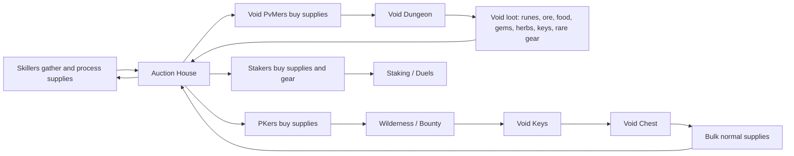

# Voidscape Economy Map and Questionnaire

Status: approved and partially implemented on 2026-06-11
Date: 2026-06-11
Scope: economy map plus owner-approved first-pass implementation plan.

## Purpose

Voidscape has several strong systems already: fast combat progression, slower skilling, starter paths, Bounty Hunter, Void Dungeon, Void Keys, Void Chest, Void gear, Auction House, subscriptions, titles, loot beams, and a polished custom client. The missing piece is a cohesive economy loop.

This document maps the current game, then turns the major balance questions into an approval questionnaire.

The core design target is:

- Keep RuneScape Classic PKing, staking, food, runes, arrows, gear, and skilling recognizable.
- Make combat training and PKing fast enough that new players reach the fun quickly.
- Make skilling slower and therefore economically meaningful.
- Make Void content valuable without replacing normal RSC gear or normal PvP strategy.
- Make Void gear primarily matter against Void monsters, not against players.
- Use normal economy goods as the main reward output: food, ores, bars, gems, herbs, runes, arrows, coins, keys, and rare cosmetics.
- Let the Auction House be the low-friction bridge between skillers, PKers, PvMers, and stakers.

## Current-State Map

### Progression

Current implementation after approval:

- Local config uses `combat_exp_rate: 10` and `skilling_exp_rate: 1.5`.
- Subscription adds `+1x` to combat and skilling XP, so the normal subscribed rates are `11x` combat and `2.5x` skilling.
- Starter paths give `2x` XP only below level 50 in selected skills:
  - Warrior: Attack, Defense, Strength.
  - Forager: Fishing, Cooking, Mining.
  - Arcanist: Ranged, Magic, Good Magic, Evil Magic.
- Rested XP gives a capped 1.5x returner boost.
- Milestone rewards pay modest coins for skill and total-level milestones.
- Gathering dry streak smoothing exists for mining, woodcutting, and fishing.

Current problem:

The rate model is now decided; the next risk is keeping rewards from flooding finished supplies faster than skillers can matter.

Recommendation:

Use `10x` combat and `2x` skilling as the baseline if the goal is to make PK-ready characters common while making skilling goods valuable. Make subscription a small additive convenience, not a huge economy divider.

### Combat, PKing, and Staking

Current implementation:

- Combat formula has already been Voidscape-tuned from OpenRSC:
  - Armor is split between avoidance and mitigation.
  - PvP melee has big-hit momentum.
  - Magic damage against players is scaled to 92%.
- Bounty Hunter marks one Wilderness target at a time.
- Claimant kill gives bounty points and one Void Key.
- Counter-kill and escape rewards exist.
- No 1v1 enforcement was added.
- Dynamic Wilderness hobgoblin scaling exists at one starter hotspot.
- Void Sparrow exists as Wilderness scouting utility.

Current problem:

Void gear must not become the new default PvP/staking gear unless we intentionally want to rewrite the core game. That would undermine the "mostly authentic RSC with custom touches" goal.

Recommendation:

Void gear should have no special PvP effects. For staking, either normalize it to its visible stats or disallow its special effects entirely. The special identity should be PvM against Void monsters.

### Market and Economy Infrastructure

Current implementation:

- Auction House exists at Edgeville through the Void Auctioneer.
- Fixed-price listings.
- 6 active listings per player.
- 7-day expiry.
- 5% seller tax as a gold sink.
- 7-day market intel exists.
- Ironman accounts are blocked.

Current problem:

The AH is strong, but the reward loops do not yet consistently push players into buying from each other.

Recommendation:

Do not add another marketplace system. Use the AH as the center of the economy. Tune content so high-volume trade goods pass through it:

- Food from fishers/cooks.
- Arrows and bows from woodcutting/fletching.
- Runes from drops and, if enabled, Runecraft.
- Ores/bars/gear from mining/smithing.
- Herbs/secondaries/potions from Herblaw and, if enabled, Harvesting.
- Void Keys and Void gear from Wilderness/PvM.

### Void Content

Current implementation:

- Void Enclave exists as a safe hub.
- Void Dungeon exists as a shared Wilderness-style PvM area.
- Void Dungeon entrance:
  - Surface rift at `(112,296)`.
  - Entry fee: `100,000` coins.
  - Arrival: `(72,3252)`.
  - Exit rift: `(72,3250)`.
  - Return: `(112,297)`.
- Void Dungeon NPCs:
  - `853` Void Knight.
  - `854` Void Spider.
  - `855` Void Giant.
  - `856` Void Wolf.
  - `857` Void Demon.
  - `858` Void Ogre.
  - `859` Void Wizard.
  - `860` Void Unicorn.
- Void drops currently include coins, runes, gems, secondary ingredients, and rare Void gear.
- Void Chest consumes Void Key `1601`.
- Void Chest rewards include noted iron ore, coal, swordfish, lobster, big bones, gems, arrows, runes, and coins.
- Bounty Hunter awards Void Keys.
- Wilderness NPCs can roll rare Void Keys.
- Void Rush exists in code as a group survival minigame with Christmas cracker hooks, but it is still not a stable economy pillar.
- Void Colossus work exists, but the boss idea has been intentionally paused.

Current problem:

The Void systems now have a clearer rule: Void gear special effects are for Void PvM, while visible stats are all that matter elsewhere. The remaining tuning problem is reward volume and how strongly Void Dungeon feeds normal economy goods.

Recommendation:

Define "Void" as a PvM branch:

1. Players get normal supplies from skillers or AH.
2. Players risk coins/items entering Void Dungeon.
3. Void monsters drop supplies, keys, and rare Void gear.
4. Void gear makes future Void PvM better.
5. Void PvM outputs normal trade goods back into the economy.
6. PKers consume those goods through Wilderness, Bounty, staking, and normal combat.

### Current Void Items

| Item | ID | Current role | Issue | Recommendation |
|---|---:|---|---|---|
| Void Scimitar | 1593 | Untradable, 70 Attack, strong melee stats, magic bonus | Could become PvP/staking power creep if special effects are global | Anti-Void melee weapon only |
| Void Shortbow | 1594 | Tradable, 80 Ranged, needs no arrows only against Void NPCs | No-arrow ranged can harm arrow economy if global | Preserve current Void-only ammo waiver |
| Void Amulet | 1595 | Tradable, boosts stackable Void NPC drops by 1.5x | Biggest economy-risk item if global | Keep boost restricted to Void NPCs only |
| Void Mace | 1596 | Tradable, 60 Attack/Strength, crush-style weapon | Needs a real niche | Anti-Void crush weapon only |
| Void Key | 1601 | Tradable key for Void Chest | Good bridge item | Keep as tradeable Wilderness/PvM bridge |
| Subscription card | 1602 | Tradable one-week account subscription | Good low-friction model | Keep subscription per account and card tradable |
| Void Sparrow | 1603 | Tradable Wilderness scouting utility | Good utility item, not direct power | Keep as rare utility; decide source |

## Proposed Economy Spine

The cleanest economy loop is not "add lots of new systems." It is:

The key is that every player type should need something another player type can produce or earn.

### Combat Players Need

Combat players need repeat-consumed supplies:

- Cooked food.
- Strength/attack/defense/ranging/prayer-related potions where available.
- Runes.
- Arrows.
- Replacement gear.
- Teleport/movement utility.
- Void Keys if they want chest rolls.
- Void Sparrow for scouting.

### Skillers Need

Skillers need reasons to exist beyond maxing:

- Their goods should be consumed by combat players.
- Some rare utility items should come from skilling.
- Slow skilling makes high-level production valuable.
- AH pricing should tell them what is worth making.

### PvMers Need

PvMers need repeatable risk/reward:

- Pay a real entrance fee.
- Use supplies.
- Risk Wilderness contact.
- Farm Void monsters for drops.
- Sell loot to skillers/PKers.
- Chase rare Void gear for better Void PvM.

### PKers Need

PKers need populated Wilderness incentives without forcing everyone into PvP:

- Bounty target action.
- Void Dungeon entrance/exit traffic.
- Void Key demand.
- Sparrow scouting.
- Food/rune/arrow demand.
- Player loot from risk areas.

## Skill-by-Skill Economy Map

### Attack, Strength, Defense, Hits

Current role:

- Core combat progression.
- Primary PK/staking identity.
- Warrior path accelerates Attack/Defense/Strength below 50.

Recommended economy role:

- Leave core formulas stable.
- Let combat players be demand engines for supplies.
- Do not make Void melee gear better than familiar PvP gear against players.

Question:

- Should Void melee weapons have special effects only against Void NPCs?

Recommended answer: yes.

### Ranged

Current role:

- Combat style using bows/arrows.
- Arcanist path accelerates Ranged below 50.
- Void Shortbow needs no arrows only against Void NPCs.

Recommended economy role:

- Keep arrows valuable.
- Avoid a permanent no-arrow PvP bow.
- Let Void Shortbow become a Void-monster ranged tool.

Question:

- Should Void Shortbow consume arrows outside Void PvM?

Recommended answer: yes.

### Magic, Good Magic, Evil Magic

Current role:

- Combat style.
- Uses runes.
- Arcanist path accelerates Magic below 50.
- Void Dungeon drops chaos, death, blood, and soul runes.

Recommended economy role:

- Keep runes as one of the main PK/PvM sinks.
- Let Void Dungeon inject runes carefully, but not so much that shops/Runecraft become irrelevant.
- If Runecraft is enabled later, make it complement drops rather than be invalidated by drops.

Question:

- Should Void NPCs remain a strong source of mid/high runes?

Recommended answer: yes, but tune with telemetry.

### Prayer

Current role:

- Combat utility.
- Bones/big bones are training inputs.
- Void Chest can reward noted big bones.

Recommended economy role:

- Keep bones as a meaningful side reward from PvM.
- Avoid flooding Prayer too hard if skilling rate becomes 2x.

Question:

- Should Void Chest keep big bones as a reward?

Recommended answer: yes, but at modest weight.

### Fishing and Cooking

Current role:

- Food production.
- Forager path accelerates both below 50.
- Void Chest already rewards cooked swordfish and lobster.
- DeathMatch rewards also include noted food.

Recommended economy role:

- This should be one of the main skiller to PKer loops.
- PvM should drop some food, but not enough to kill demand for fishers/cooks.
- High-volume food should mostly come from players, not chests.

Question:

- Should Void Chest drop cooked food or raw/processable fish?

Recommended answer: mixed, but lean toward raw/processable if skiller value is the priority.

### Woodcutting and Fletching

Current role:

- Woodcutting produces logs.
- Fletching produces bows/arrows.
- Guaranteed resource smoothing exists.
- User has suggested rare skilling drops like Void Sparrow from woodcutting.

Recommended economy role:

- Make arrows and bows matter by avoiding free ranged ammo in normal combat.
- Consider rare utility drops from high-level woodcutting, especially Void Sparrow.
- Keep rare utility tradable so skillers can sell to PKers.

Question:

- Should Void Sparrow be primarily a rare high-level woodcutting drop?

Recommended answer: yes, with possible secondary sources from Void Chest or Bounty.

### Firemaking

Current role:

- Mostly XP/achievement.
- Produces fires and ashes.
- Skillcape extends/customizes fire duration.

Recommended economy role:

- Do not force a huge new Firemaking system.
- Best low-risk roles:
  - Keep it achievement/cosmetic.
  - Add a small Void-only utility later, if needed.
  - Use ashes as a minor input if Herblaw/Prayer needs a sink.

Question:

- Should Firemaking stay mostly authentic for now?

Recommended answer: yes.

### Mining and Smithing

Current role:

- Mining produces ores/gems.
- Smithing turns bars into gear.
- Forager path accelerates Mining below 50.
- Void Chest already rewards noted iron ore and coal.
- DeathMatch rewards include rune items and runite ore.

Recommended economy role:

- Let Void content inject ore/coal/gems, but skillers should still process and supply gear.
- Consider making chest rewards more processable than finished.
- Be cautious with too many finished rune items from PvM because it can undercut smithing.

Question:

- Should Void rewards favor ore/bars over finished gear?

Recommended answer: yes.

### Crafting

Current role:

- Gems, jewelry, leather, glass, battlestaves, etc.
- Void Chest drops uncut gems.

Recommended economy role:

- Let Void content feed gems to crafters.
- Avoid making jewelry best-in-slot through Void effects unless Void-only.
- Consider cosmetic or title progression rather than raw combat power.

Question:

- Should Void Chest keep uncut gems as a main skiller-facing reward?

Recommended answer: yes.

### Herblaw

Current role:

- Produces potions from herbs and secondaries.
- Some custom potions exist.
- Void Spider drops red spiders eggs; Void Unicorn drops unicorn horn.

Recommended economy role:

- This is a natural PK/PvM supply skill.
- Void monsters should drop some secondaries, not necessarily full potions.
- Let Herblaw players capture value by processing drops.

Question:

- Should Void monsters favor herb secondaries over finished combat potions?

Recommended answer: yes.

### Agility and Thieving

Current role:

- Authentic skill content exists.
- No strong Void economy hook yet.

Recommended economy role:

- Avoid adding forced hooks now.
- Later, consider shortcuts/access or safe-ish utility, not direct money printing.

Question:

- Should Agility/Thieving stay mostly unchanged for the first economy pass?

Recommended answer: yes.

### Runecraft

Current role:

- Custom Runecraft code exists.
- Local config currently has `want_runecraft: false`.
- Supports several rune types in code, but not necessarily every high rune.
- Runecraft potions exist.

Recommended economy role:

- Decide whether this is part of launch or post-launch.
- If enabled, it should be a skiller supply route for mage PKers.
- Void monster rune drops must be tuned around it.

Question:

- Should Runecraft be enabled for launch economy?

Recommended answer: no for first beta economy pass unless we specifically want another balancing surface.

### Harvesting

Current role:

- Custom Harvesting code exists.
- Local config currently has `want_harvesting: false`.
- Produces herbs, seaweed, snape grass, limpwurt, fruit/palm/bush/allotment items.
- Some custom cooking/herblaw recipes use these items.

Recommended economy role:

- Great future skiller loop.
- Probably too much to make core before the existing economy is coherent.

Question:

- Should Harvesting be enabled for launch economy?

Recommended answer: no for first beta economy pass.

## Main Design Risks

### Risk: Void Gear Replaces RSC Gear

If Void items are strong everywhere, players stop caring about classic gear progression.

Mitigation:

- Special effects only against Void NPCs.
- No special effects in PvP.
- No special effects in staking.
- Keep visible stats conservative.

### Risk: PvM Drops Kill Skilling

If Void Dungeon and Void Chest drop too many finished supplies, skillers become pointless.

Mitigation:

- Prefer raw/processable rewards.
- Let skillers process into best trade goods.
- Use telemetry and AH prices to tune.

### Risk: Skilling Is Slow But Not Profitable

If skilling is 2x but goods are worthless, skilling feels punishing.

Mitigation:

- Make combat consume skilling goods constantly.
- Keep no-arrow/no-rune/free-supply mechanics tightly restricted.
- Let rare utility drops come from skilling.

### Risk: Subscriptions Feel Pay-To-Win

If subscription is too large, unsubscribed players feel second-class.

Mitigation:

- Subscription should be convenience and support, not an economic wall.
- Consider `+1x` rates rather than large floors.
- Keep the physical card tradable.

### Risk: Void Amulet Quietly Inflates Everything

Current Void Amulet behavior boosts stackable Void NPC drops only.

Mitigation:

- Restrict boost to Void NPCs only.
- Consider making it boost Void Key/chest economy rather than every stackable drop.

## Recommended First Economy Pass

This is my preferred minimal-change direction:

1. Settle progression rates:
   - Base combat: `10x`.
   - Base skilling: `1.5x`.
   - Subscription: small account-wide boost, likely `11x / 2.5x`, or keep current floor only if we accept bigger subscription advantage.
2. Make all Void item special effects Void-PvM-only.
3. Restrict Void Amulet's stackable drop bonus to Void NPCs.
4. Make Void Shortbow preserve arrow economy outside Void PvM.
5. Keep Void Dungeon as the main shared risky PvM area:
   - 100k entrance fee.
   - Shared Wilderness danger.
   - Void NPCs drop supplies and rare Void gear.
6. Tune Void Chest toward processable skiller goods:
   - Ores, coal, gems, secondaries, runes, arrows.
   - Less finished food if cooks need more demand.
7. Use Bounty Hunter as a Void Key source, not as a separate gear treadmill.
8. Keep Runecraft and Harvesting disabled until the base economy is readable, unless you explicitly want them in launch scope.
9. Use Auction House and balance telemetry as the beta tuning dashboard.

## Questionnaire

Use this format when reviewing:

- `Approve` means implement as recommended.
- `Reject` means do not do it.
- `Modify` means keep the idea but change the details.

### A. Core Progression

1. Base XP model:
   - Recommendation: `10x` combat, `1.5x` skilling.
   - Options:
     - [ ] Approve
     - [ ] Reject
     - [ ] Modify:

2. Subscription rate model:
   - Recommendation: subscription adds a modest account-wide boost, preferably `+1x` to combat and skilling.
   - Current implementation: subscribed accounts add `+1x`, normally `11x` combat and `2.5x` skilling.
   - Options:
     - [x] Approve recommended `+1x`
     - [ ] Revisit later
     - [ ] Modify:

3. Starter paths:
   - Recommendation: keep starter path boosts only until level 50.
   - Options:
     - [ ] Approve
     - [ ] Reject
     - [ ] Modify:

4. Rested XP:
   - Recommendation: keep as-is.
   - Options:
     - [ ] Approve
     - [ ] Reject
     - [ ] Modify:

### B. Void Rules

5. Void item special effects:
   - Recommendation: special effects only work against Void NPCs.
   - Options:
     - [ ] Approve
     - [ ] Reject
     - [ ] Modify:

6. Void gear in PvP:
   - Recommendation: no special effects against players.
   - Options:
     - [ ] Approve
     - [ ] Reject
     - [ ] Modify:

7. Void gear in staking:
   - Recommendation: no special effects in stakes; visible stats only.
   - Options:
     - [ ] Approve
     - [ ] Reject
     - [ ] Modify:

8. Void gear tradability:
   - Recommendation: keep most Void gear tradable, but decide whether Void Scimitar should remain untradable.
   - Options:
     - [ ] Make all Void gear tradable
     - [ ] Keep current mixed model
     - [ ] Make all Void gear untradable
     - [ ] Modify:

### C. Individual Void Items

9. Void Scimitar `1593`:
   - Recommendation: anti-Void melee weapon; no PvP special effect.
   - Options:
     - [ ] Approve
     - [ ] Reject
     - [ ] Modify:

10. Void Mace `1596`:
   - Recommendation: anti-Void crush weapon; good against tougher Void monsters.
   - Options:
     - [ ] Approve
     - [ ] Reject
     - [ ] Modify:

11. Void Shortbow `1594`:
   - Recommendation: anti-Void ranged weapon; preserve normal arrow consumption outside Void PvM.
   - Options:
     - [ ] Approve
     - [ ] Reject
     - [ ] Modify:

12. Void Amulet `1595`:
   - Recommendation: keep the stackable-drop boost limited to Void NPC drops.
   - Options:
     - [ ] Approve
     - [ ] Reject
     - [ ] Modify:

13. Void Amulet exact effect:
   - Recommendation: boost Void NPC stackable drops modestly, or boost Void Key/rare-roll odds slightly, but not both aggressively.
   - Options:
     - [ ] Stackable Void drops only
     - [ ] Void Key/rare odds only
     - [ ] Small version of both
     - [ ] Modify:

14. Void Sparrow `1603`:
   - Recommendation: keep as Wilderness utility with no combat stats or damage.
   - Options:
     - [ ] Approve
     - [ ] Reject
     - [ ] Modify:

15. Void Sparrow source:
   - Recommendation: rare high-level Woodcutting source, with optional secondary source from Void Chest/Bounty.
   - Options:
     - [ ] High-level Woodcutting only
     - [ ] Void Chest only
     - [ ] Bounty/Void Key economy only
     - [ ] Mixed sources
     - [ ] Modify:

### D. Void Dungeon and Chest

16. Void Dungeon role:
   - Recommendation: main risky shared PvM area.
   - Options:
     - [ ] Approve
     - [ ] Reject
     - [ ] Modify:

17. Void Dungeon entrance fee:
   - Recommendation: keep `100,000` coins for now.
   - Options:
     - [ ] Approve
     - [ ] Lower
     - [ ] Raise
     - [ ] Modify:

18. Void Dungeon reward shape:
   - Recommendation: mostly normal economy goods plus rare Void gear.
   - Options:
     - [ ] Approve
     - [ ] More unique items
     - [ ] More raw supplies
     - [ ] Modify:

19. Void Chest reward shape:
   - Recommendation: lean toward raw/processable skiller goods.
   - Options:
     - [ ] Approve
     - [ ] More finished PK supplies
     - [ ] More rare chase items
     - [ ] Modify:

20. Void Keys:
   - Recommendation: keep tradeable and sourced from Bounty, Wilderness NPCs, and Void content.
   - Options:
     - [ ] Approve
     - [ ] Make untradable
     - [ ] Reduce sources
     - [ ] Modify:

### E. Skill Loops

21. Fishing/Cooking:
   - Recommendation: primary food supply should come from players; Void drops should not flood finished food.
   - Options:
     - [ ] Approve
     - [ ] Let Void drops provide more cooked food
     - [ ] Modify:

22. Woodcutting/Fletching:
   - Recommendation: preserve arrow demand; consider rare Sparrow from high-level Woodcutting.
   - Options:
     - [ ] Approve
     - [ ] Do not add rare skilling utility
     - [ ] Modify:

23. Mining/Smithing:
   - Recommendation: Void rewards favor ore/coal/gems over finished gear.
   - Options:
     - [ ] Approve
     - [ ] More finished gear
     - [ ] Modify:

24. Herblaw:
   - Recommendation: Void monsters drop secondaries; players process potions.
   - Options:
     - [ ] Approve
     - [ ] More finished potions
     - [ ] Modify:

25. Firemaking:
   - Recommendation: leave mostly authentic for first economy pass.
   - Options:
     - [ ] Approve
     - [ ] Add Void-only utility
     - [ ] Modify:

26. Crafting:
   - Recommendation: keep gems/jewelry as economy support, no broad combat power creep.
   - Options:
     - [ ] Approve
     - [ ] Add Void jewelry effects
     - [ ] Modify:

27. Agility/Thieving:
   - Recommendation: leave mostly unchanged for first economy pass.
   - Options:
     - [ ] Approve
     - [ ] Add access/shortcut utility
     - [ ] Modify:

28. Runecraft:
   - Recommendation: keep disabled for first beta economy pass unless it becomes a deliberate launch pillar.
   - Options:
     - [ ] Keep disabled
     - [ ] Enable and balance around it
     - [ ] Modify:

29. Harvesting:
   - Recommendation: keep disabled for first beta economy pass unless Herblaw needs a full farming-style supply chain.
   - Options:
     - [ ] Keep disabled
     - [ ] Enable and balance around it
     - [ ] Modify:

### F. Economy and Monitoring

30. Auction House:
   - Recommendation: make AH the main trade bridge; no new exchange system.
   - Options:
     - [ ] Approve
     - [ ] Reject
     - [ ] Modify:

31. AH tax:
   - Recommendation: keep 5% seller tax at first.
   - Options:
     - [ ] Approve
     - [ ] Lower
     - [ ] Raise
     - [ ] Modify:

32. Telemetry:
   - Recommendation: tune using `::balancereport`, drop logs, AH prices, and beta feedback.
   - Options:
     - [ ] Approve
     - [ ] Reject
     - [ ] Modify:

33. Economy change policy:
   - Recommendation: avoid more global combat formula changes until this economy pass is tested.
   - Options:
     - [ ] Approve
     - [ ] Reject
     - [ ] Modify:

## Implementation Slices After Approval

These were the approved first implementation slices.

1. Reconcile XP/subscription model.
2. Add a shared `isVoidNpc` helper/policy.
3. Restrict Void Amulet global boost to Void NPCs.
4. Restrict/retune Void Bow ammo behavior.
5. Add Void-only item bonuses for Scimitar, Mace, Bow, and Amulet.
6. Retune Void Dungeon and Void Chest drops toward approved economy shape.
7. Add/adjust Void Sparrow source if approved.
8. Add beta admin report presets for Void economy telemetry.
9. Update docs and beta tester instructions.

## Current Best Verdict

Voidscape does not need a pile of new features to feel cohesive. It needs a clear rule:

Void content should create a risky PvM branch that consumes normal supplies, rewards normal economy goods, and gives Void gear value only inside that branch.

That keeps PKing and staking familiar, makes skilling matter, gives PvM a loop, and lets the Auction House become the place where all of those playstyles meet.
